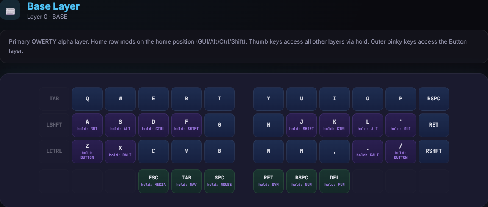
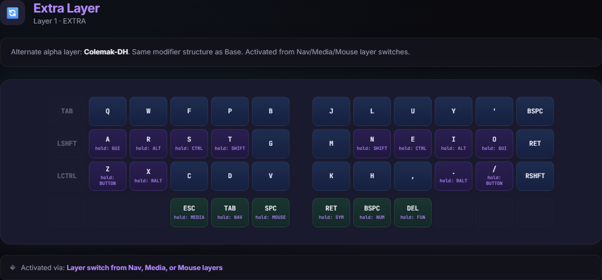
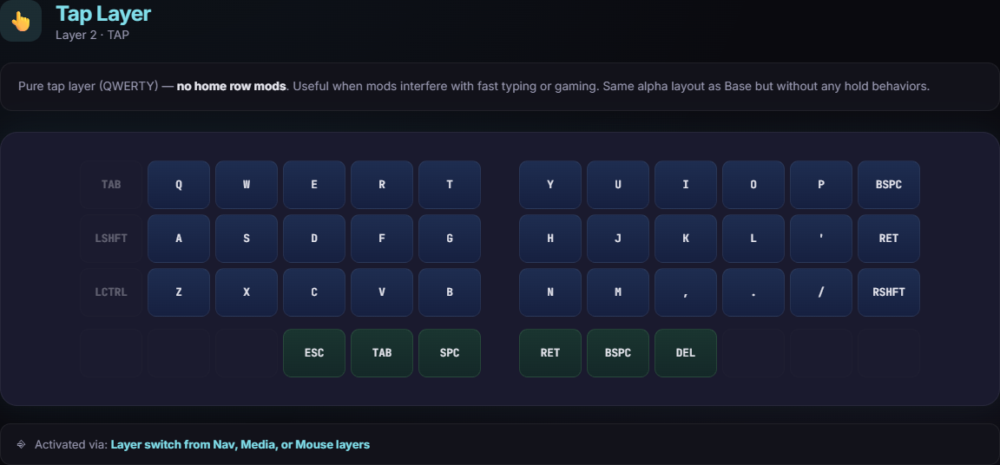
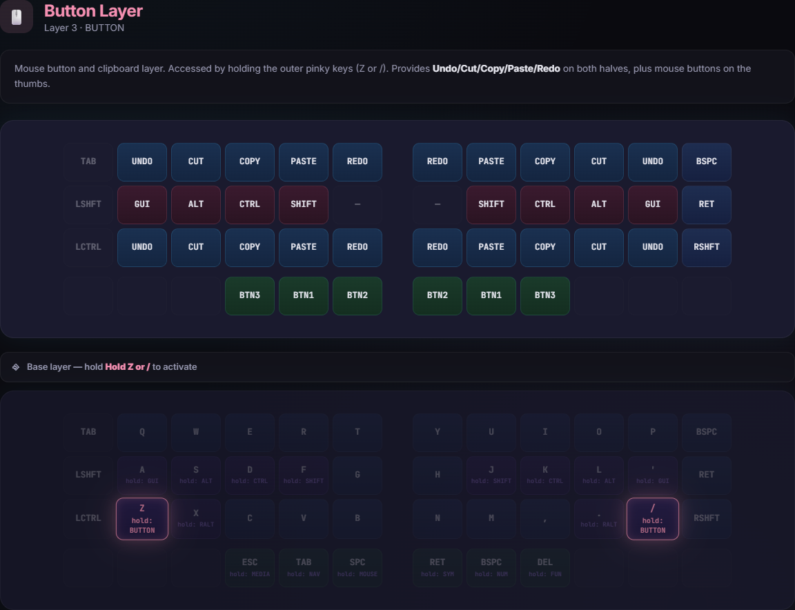
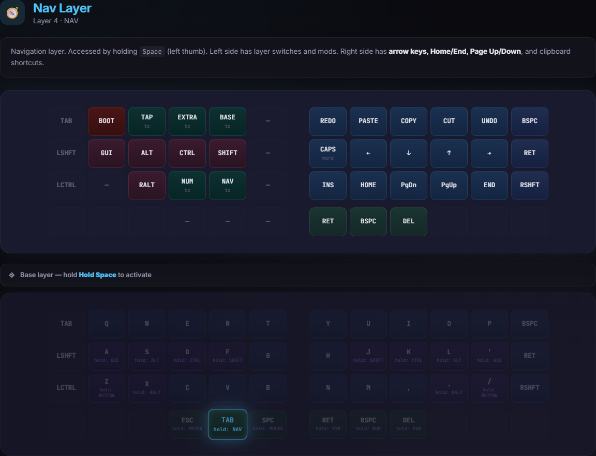
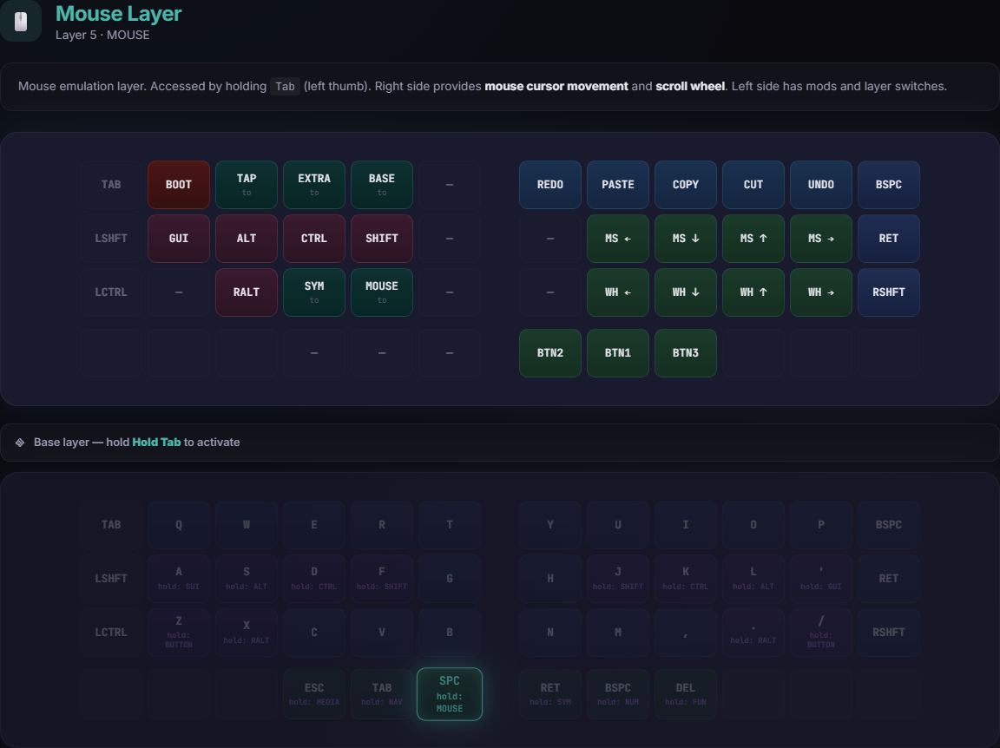
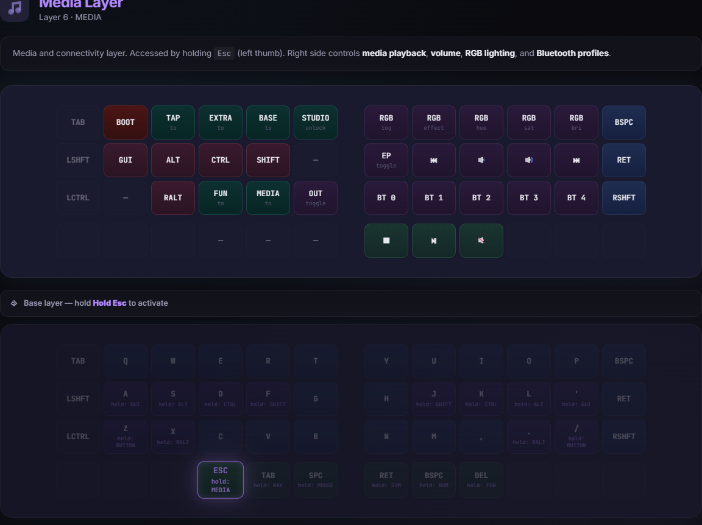
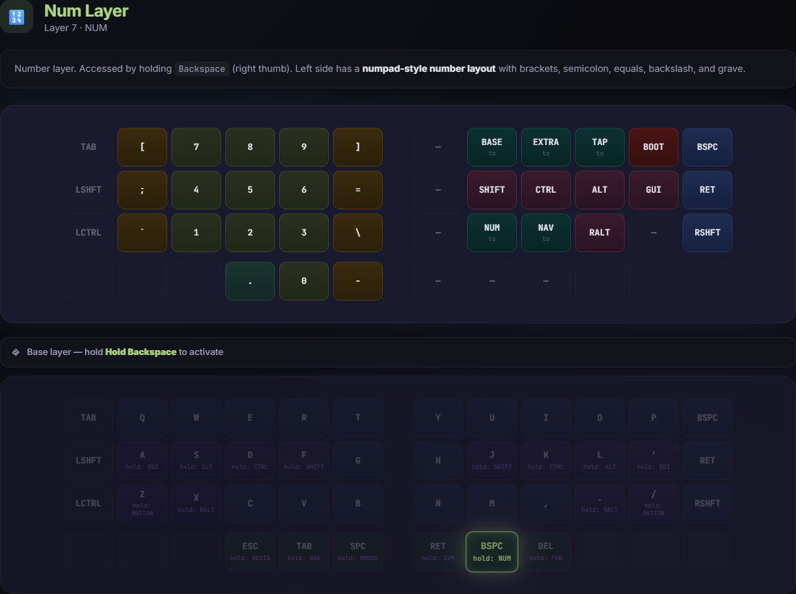
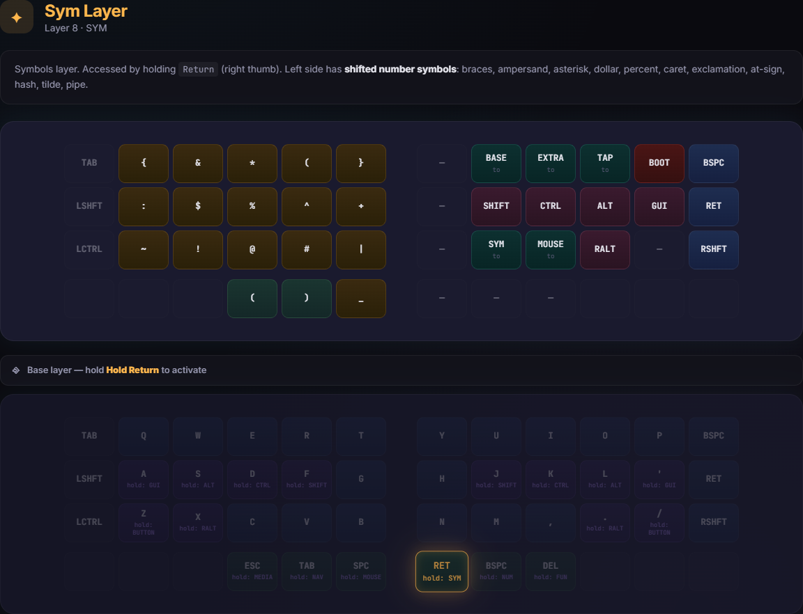
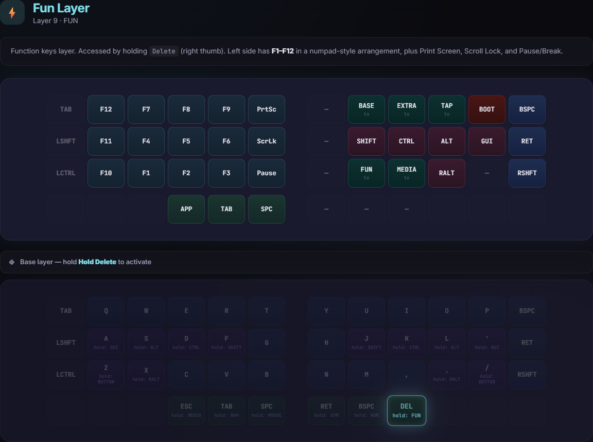

# Custom Miryoku Layout for ZMK

This repository contains a customised ZMK firmware configuration originally based on the Miryoku framework. It has been specifically targeted and built for a 46-key Corne Choc Pro (6 columns by 3 rows each side, plus 3 thumb keys per half).

## Key Modifications

* **6-Column (46 Key) Layout Adapter:** The standard 40-key Miryoku layout mapping has been safely extended to operate on the 46-key physical layout without throwing blanks on your outer columns. The outer pinky columns now support functional placeholders logic:
    * **Left Side (Top to Bottom):** `TAB`, `LSHIFT`, `LCTRL`
    * **Right Side (Top to Bottom):** `BSPC`, `ENTER`, `RSHIFT`
* **Custom Tap Swaps for Thumbs:** The native Miryoku `SPACE` and `TAB` keys have had their TAP behaviors swapped across the board. 
   - Left Middle Thumb now taps `TAB` but continues to output the `NAV` Layer on Hold. 
   - Left Inner Thumb now taps `SPACE` but continues to output the `MOUSE` Layer on Hold. 
* **Custom Config Document:** The `docs/miryoku_layers.html` file has been structurally patched to fully visualize and document the extra 6th column dynamically on both the left and right halves accurately rendering a correct 12-key horizontal split visual layout representation without skipping visual items or drawing odd gaps. 

## Building
Use the normal ZMK Github Actions workflow located in `.github/workflows/build.yml` to trigger the build for config matrix definitions.

## Layer Visualizations

Here is how the layout looks across all of the customized layers:

### Base Layer

### Extra Layer

### Tap Layer

### Button Layer

### Nav Layer

### Mouse Layer

### Media Layer

### Num Layer

### Sym Layer

### Fun Layer

